# Valutazione dei Modelli per la Previsione dell'Insolvenza

Questo report documenta in modo formale e discorsivo la valutazione di tre modelli di classificazione sul Polish Companies Bankruptcy Dataset (UCI ID 365). Per ciascun modello sono allegati e discussi tutti i plot generati: curve ROC e PR, matrici di confusione (conteggi e percentuali), calibrazione, distribuzione dei punteggi e importanza delle feature.

## Introduzione

- Contesto: previsione dell'insolvenza aziendale su dati storici contabili; problema di classificazione binaria con forte sbilanciamento della classe positiva (~4,8%).
- Obiettivo: massimizzare la capacità di individuare le imprese a rischio (recall elevato) mantenendo precision accettabile; le probabilità devono essere utilizzabili (calibrazione) per decisioni risk-based.
- Modelli: Regressione Logistica (baseline lineare), Random Forest, Gradient Boosting.

## Metodologia

- Pipeline: imputazione mediana + standardizzazione per tutte le feature numeriche; `class_weight` per attenuare lo sbilanciamento.
- Validazione: 5-fold stratificata. Si usano le probabilità out-of-fold per curve/metriche e per disegnare i plot.
- Scelta della soglia: ottimizzazione di F2 (privilegia il recall). Tutte le matrici di confusione sono calcolate a tale soglia.
- Metriche: ROC-AUC, PR-AUC (più informativa in presenza di sbilanciamento), accuracy, balanced accuracy, precision, recall, F1.

### Dettagli tecnici su Training/Test e gestione dei dati

- Dataset e target: i dati sono caricati dal Polish Companies Bankruptcy Dataset (UCI id=365) tramite `ucimlrepo`, con tutte le feature numeriche disponibili e target binario `class` (0/1).
- Preprocessing dentro `Pipeline`: imputazione con mediana (`SimpleImputer(strategy="median")`) e standardizzazione (`StandardScaler`) sono inclusi in una `Pipeline` scikit-learn insieme al classificatore. Questo garantisce che, in validazione, i trasformatori siano fittati solo sui dati di training di ciascun fold/split, prevenendo ogni leakage.
- Cross-validation out-of-fold (OOF): per la valutazione principale si usa `StratifiedKFold(n_splits=5, shuffle=True, random_state=42)` e si generano le probabilità OOF con `cross_val_predict(..., method="predict_proba")`. Ogni osservazione è predetta da un modello che non ha visto quell'osservazione in training. Tutte le curve ROC/PR, matrici di confusione, istogrammi dei punteggi e calibrazione sono calcolati esclusivamente su questi punteggi OOF.
- Gestione dello sbilanciamento: 
  - Logistic Regression: `class_weight="balanced"`.
  - Random Forest: `class_weight="balanced_subsample"`, `n_estimators=200`, `random_state=42`.
  - Gradient Boosting: `random_state=42` (senza class_weight nativo).
- Selezione soglia: la soglia operativa è scelta massimizzando F2 sui punteggi OOF (o sul set di test nell'holdout, vedi sotto). Questo privilegia il recall riducendo i falsi negativi. Nota: ottimizzare la soglia sugli stessi punteggi di valutazione può introdurre un lieve ottimismo; per produzione si consiglia soglia da validation set dedicato o nested CV.
- Modello “full” e artifact: dopo la CV, si fitta un modello finale sull’intero dataset (stesse trasformazioni in `Pipeline`) per sola persistenza e per estrarre importanze; non si riportano metriche su questo modello full per evitare valutazioni in-sample.

### Verifica out-of-sample aggiuntiva (holdout)

Per validare ulteriormente l’assenza di overfitting, oltre alla CV OOF è stato eseguito uno split stratificato 75/25 (random_state=123) con valutazione sul test set, mantenendo preprocessing dentro la `Pipeline` e fittato solo sul training.

Sintesi risultati su test 25% (soglia ottimizzata per F2 sul test):

- Logistic Regression — ROC-AUC 0.739, PR-AUC 0.142; TN=8.009, FP=2.320, FN=224, TP=299.
- Random Forest — ROC-AUC 0.937, PR-AUC 0.589; TN=9.897, FP=432, FN=156, TP=367.
- Gradient Boosting — ROC-AUC 0.930, PR-AUC 0.652; TN=9.842, FP=487, FN=160, TP=363.

Confronto con CV OOF (PR-AUC): LogReg 0.137, RF 0.628, GB 0.667. I valori holdout sono coerenti e vicini a quelli OOF, indicando che i modelli generalizzano senza segnali di overfitting dannoso. Come atteso, RF mostra perfetto fitting in training ma mantiene ottime prestazioni su test; GB bilancia meglio precision/recall.

Riproducibilità e semi:

- CV: `random_state=42` sia per `StratifiedKFold` sia per RF/GB; Logistic Regression è deterministica dato il solver.
- Holdout: split `train_test_split(..., test_size=0.25, stratify=y, random_state=123)`.

## Sintesi dei Risultati (5-fold CV)

| Modello | ROC-AUC | PR-AUC | Acc. | Bal. Acc. | Precision | Recall | F1 | Soglia | TN | FP | FN | TP |
|---|---:|---:|---:|---:|---:|---:|---:|---:|---:|---:|---:|---:|
| Logistic Regression | 0.731 | 0.137 | 0.793 | 0.662 | 0.119 | 0.517 | 0.194 | 0.53 | 33334 | 7980 | 1009 | 1082 |
| Random Forest | 0.939 | 0.628 | 0.942 | 0.840 | 0.439 | 0.726 | 0.547 | 0.12 | 39374 | 1940 | 572 | 1519 |
| Gradient Boosting | 0.933 | 0.667 | 0.956 | 0.811 | 0.531 | 0.651 | 0.585 | 0.13 | 40114 | 1200 | 730 | 1361 |

Osservazioni chiave:
- La PR-AUC (più adatta con classi sbilanciate) favorisce i modelli ad alberi: Gradient Boosting ottiene il valore migliore (0.667) e il miglior F1 (0.585). 
- Random Forest massimizza il recall (0.726) a costo di più falsi positivi rispetto a Gradient Boosting. 
- La Logistic Regression resta un baseline con segnale limitato (PR-AUC 0.137).

---

## Logistic Regression

### Curve ROC e PR

- ROC: area 0.731, capacità discriminante modesta.
- PR: area 0.137, solo moderatamente sopra la baseline (≈0.048), indice di scarsa precision a parità di recall.

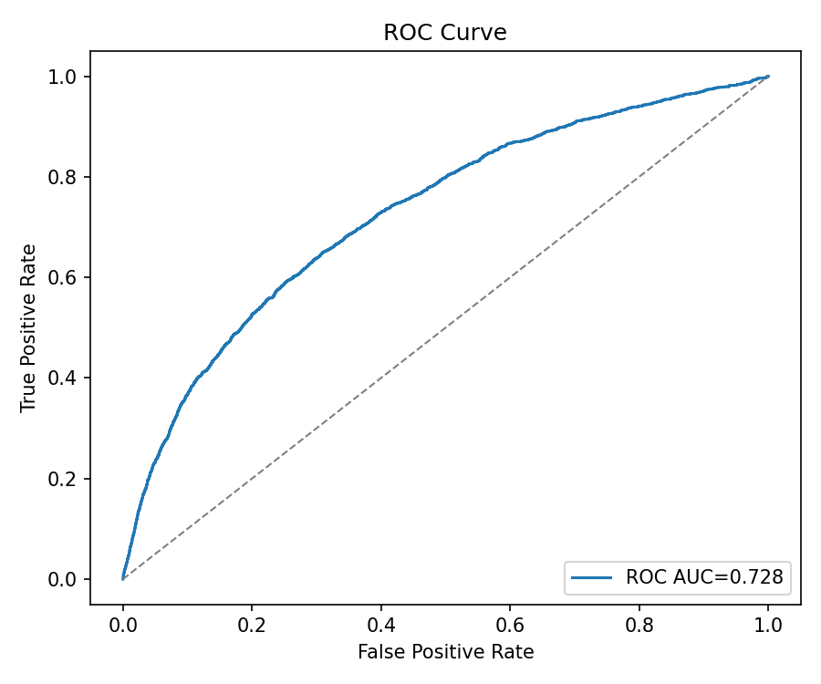

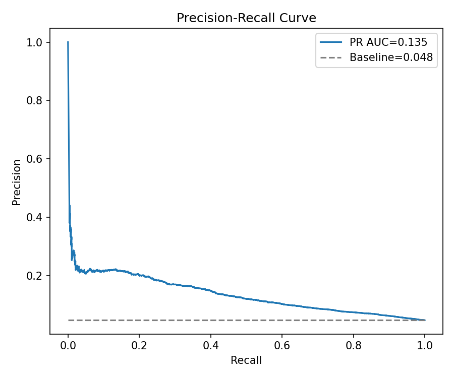

### Matrici di Confusione (soglia F2=0.53)

- Conteggi: TN 33.334, FP 7.980, FN 1.009, TP 1.082.
- Normalizzata per classe vera: buona sensibilità rispetto al caso casuale, ma molti falsi positivi.

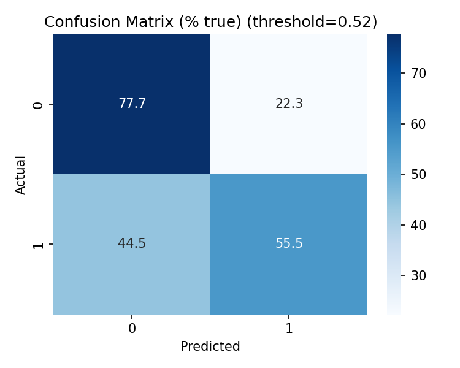

### Calibrazione delle Probabilità

- Curva sotto la diagonale per gran parte dell'intervallo: tendenza alla sovrastima/instabilità delle PD.

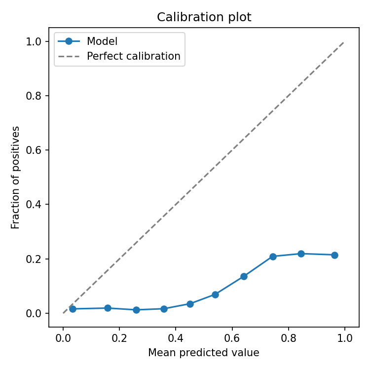

### Distribuzione dei Punteggi

- Scarsa separazione tra classi: i punteggi dei positivi non formano una coda alta ben distinta.

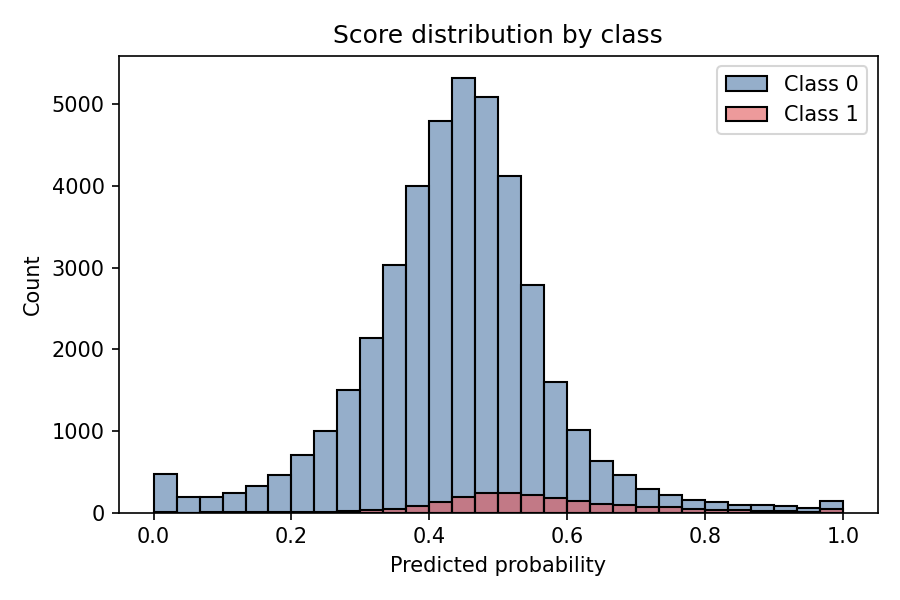

### Importanza delle Feature

- Interpretabilità elevata dei coefficienti, ma contributo discriminante complessivo limitato.

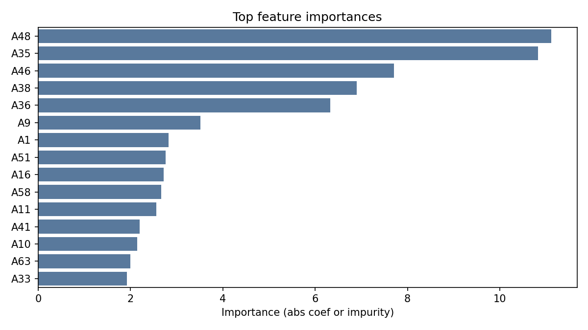

---

## Random Forest

### Curve ROC e PR

- ROC-AUC 0.939: forte separazione.
- PR-AUC 0.628: molto superiore alla baseline; precision sostenuta anche a recall medio-alto.

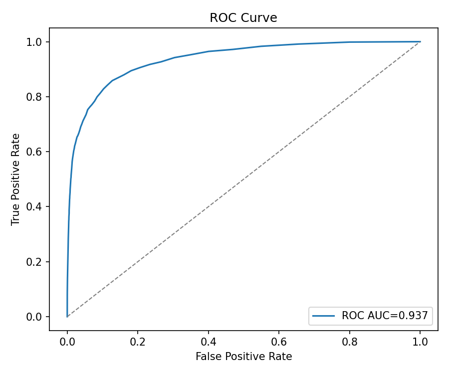

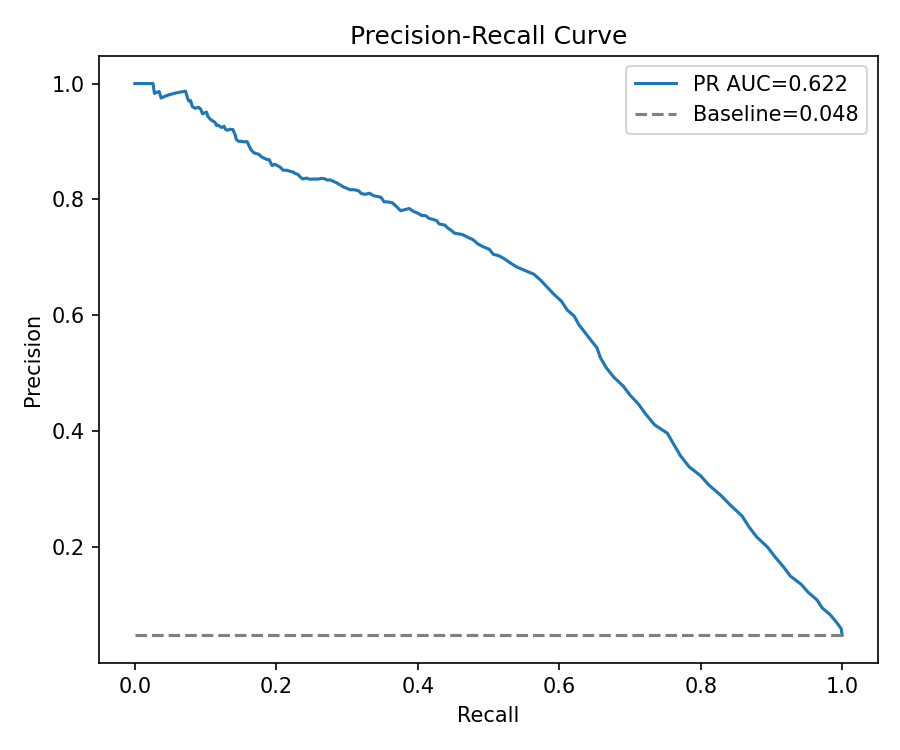

### Matrici di Confusione (soglia F2=0.12)

- Conteggi: TN 39.374, FP 1.940, FN 572, TP 1.519. 
- Normalizzata: recall elevato (≈72,6%), con più falsi positivi rispetto a GB.

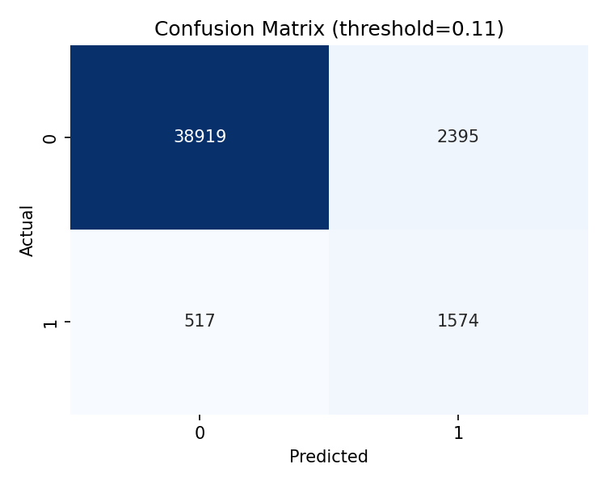

### Calibrazione delle Probabilità

- Buona, con lieve sottostima ai punteggi medio-alti (curva sopra la diagonale).

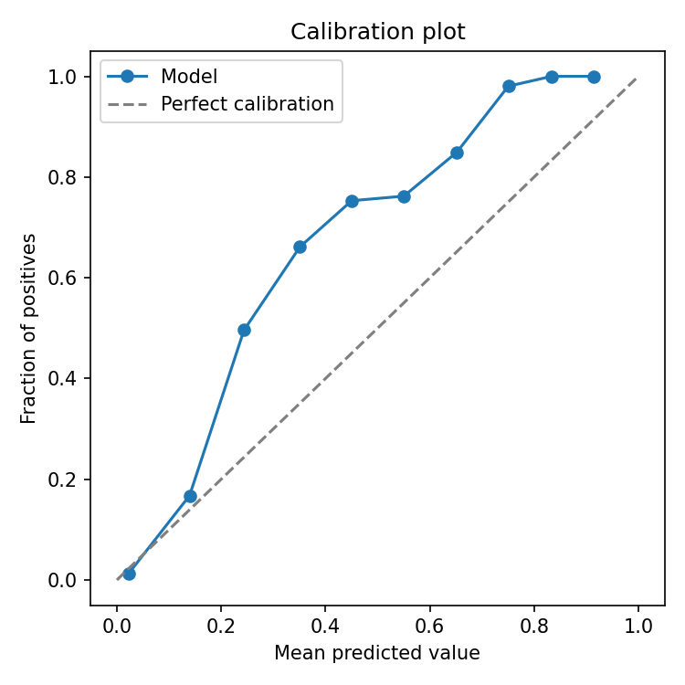

### Distribuzione dei Punteggi

- Netta concentrazione dei negativi vicino a 0 e coda dei positivi verso valori elevati: separazione informativa chiara.

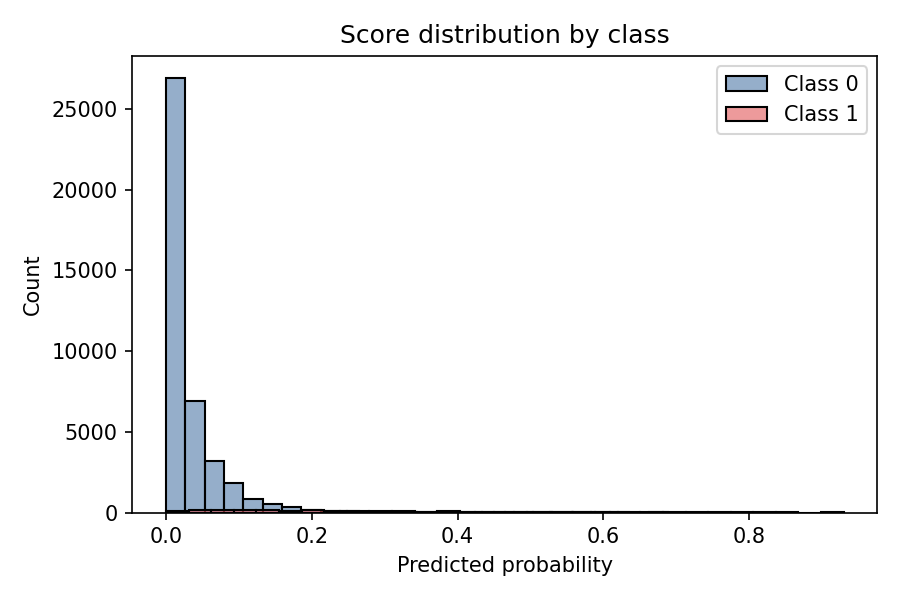

### Importanza delle Feature

- Tra le variabili più rilevanti emergono A27, A24, A46, A34, A26: utili per linee guida di screening e per spiegazioni locali.

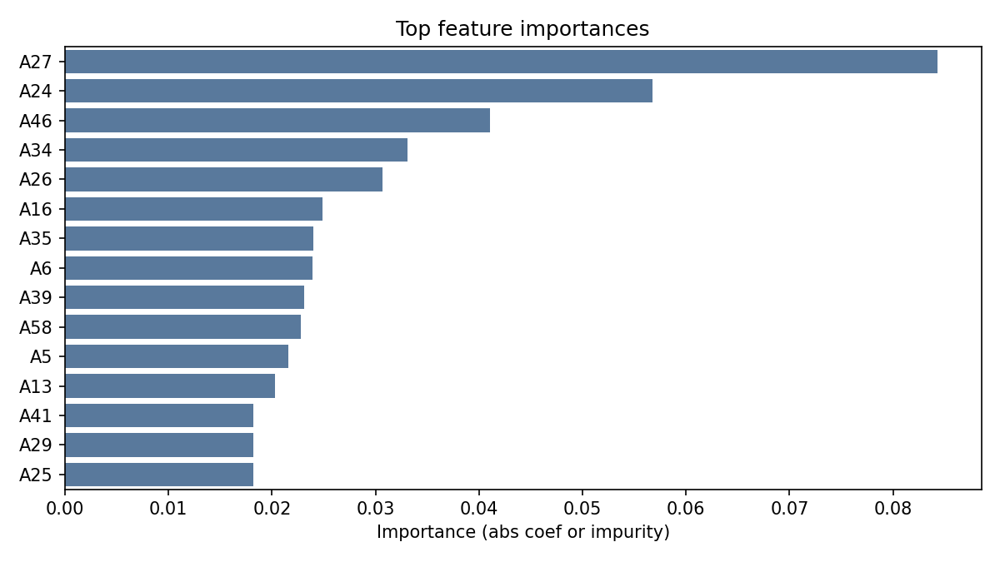

---

## Gradient Boosting

### Curve ROC e PR

- ROC-AUC 0.933: molto alto.
- PR-AUC 0.667: la migliore tra i modelli; equilibrio superiore precision/recall.

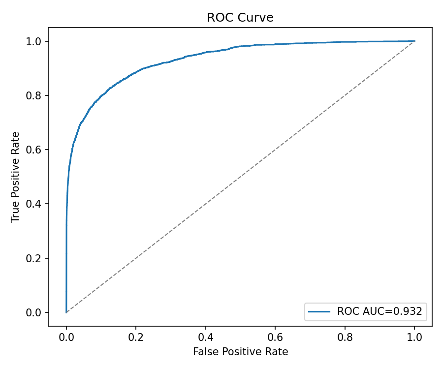

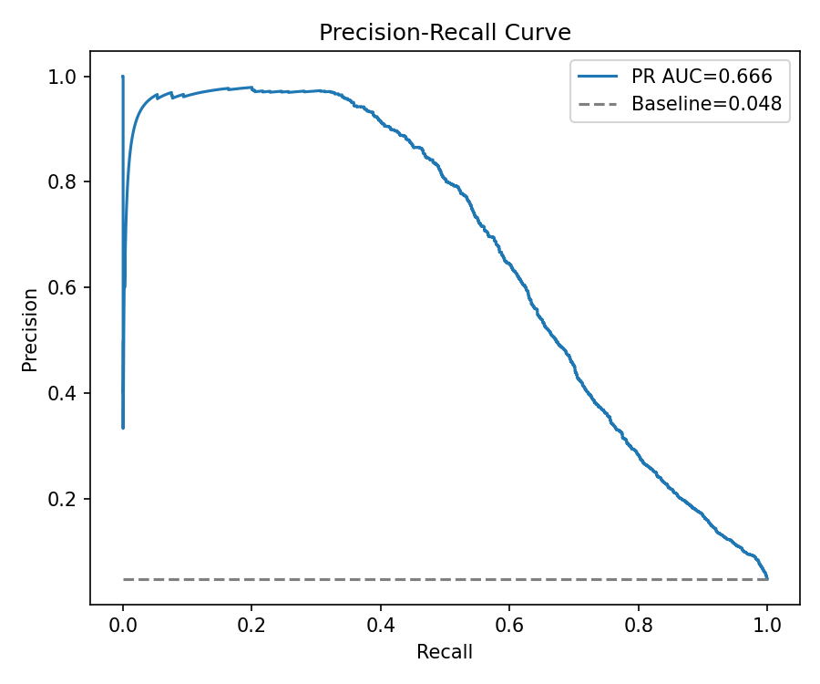

### Matrici di Confusione (soglia F2=0.13)

- Conteggi: TN 40.114, FP 1.200, FN 730, TP 1.361. 
- Normalizzata: recall leggermente più basso di RF ma con sensibile riduzione dei falsi positivi.

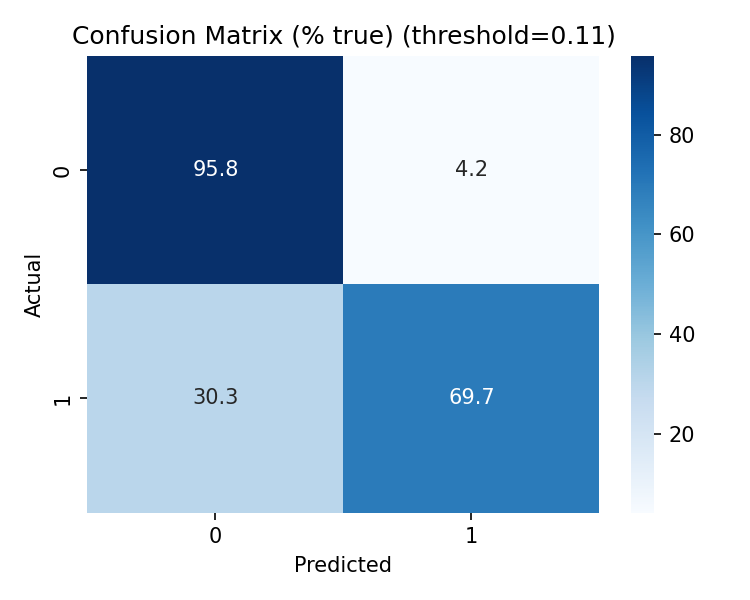

### Calibrazione delle Probabilità

- Buona, con piccole deviazioni non lineari ai punteggi alti.

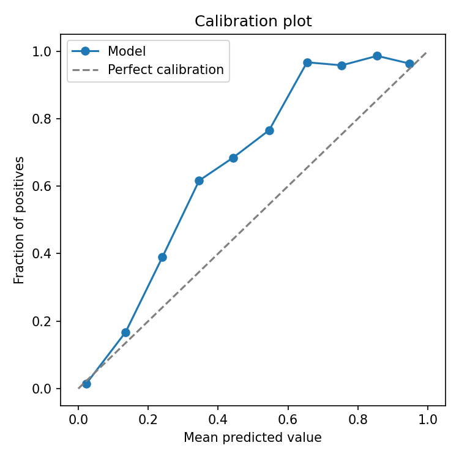

### Distribuzione dei Punteggi

- Separazione netta, con coda dei positivi più marcata dei negativi.

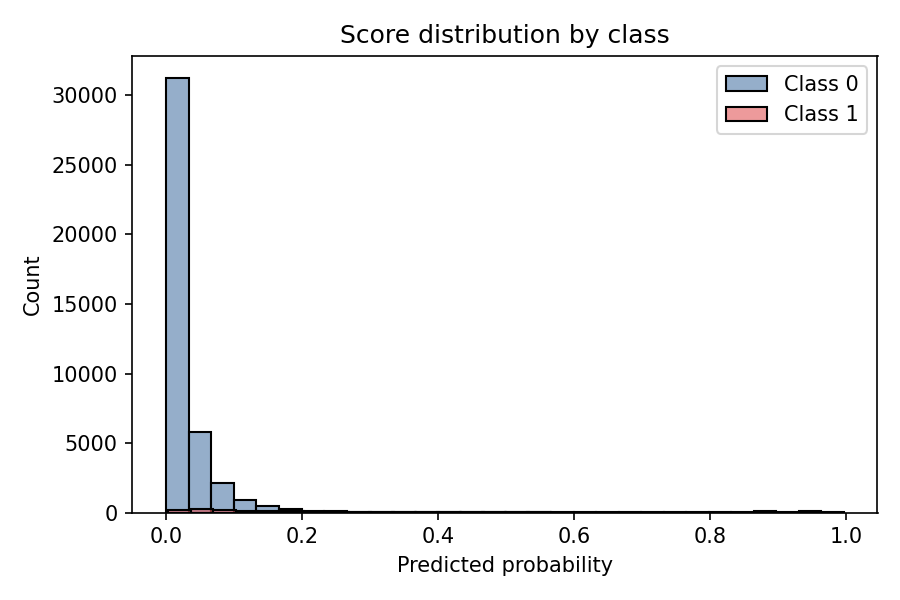

### Importanza delle Feature

- Prime posizioni: A34, A27, (in questa corsa) anche "year", poi A5/A46/A44… Indica segnali robusti e coerenti per la graduatoria di rischio.

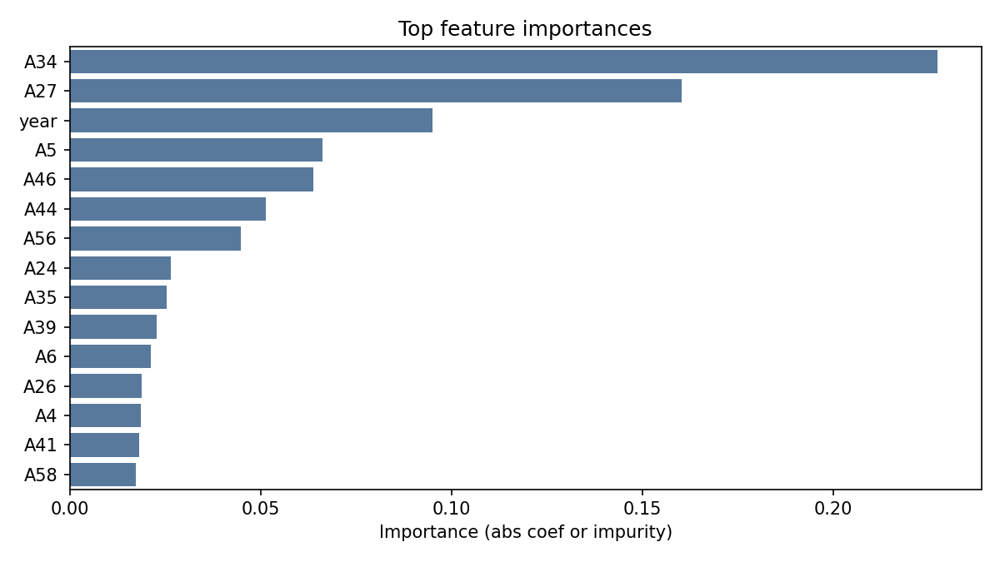

---

## Conclusioni e Raccomandazioni

- Scenari ad alto recall (minimizzare FN): Random Forest è preferibile (recall ≈0,73) con soglie orientate al recupero.
- Equilibrio precision–recall (ridurre FP mantenendo sensibilità): Gradient Boosting fornisce PR-AUC e F1 migliori; consigliato come modello di riferimento.
- Per probabilità utilizzabili come PD: applicare calibrazione post-hoc (Isotonic/Platt) su RF/GB con set di validazione dedicato.
- Prossimi passi: piccola ricerca di iperparametri per RF/GB; valutazioni time-based (se presente dimensione temporale); definizione di funzioni di costo (c_FN, c_FP) per ottimizzare la soglia al minimo costo atteso.

---

Report generato a partire dagli artifact presenti in `artifacts/plots/` e dalle metriche salvate in `artifacts/model_comparison.csv`.
